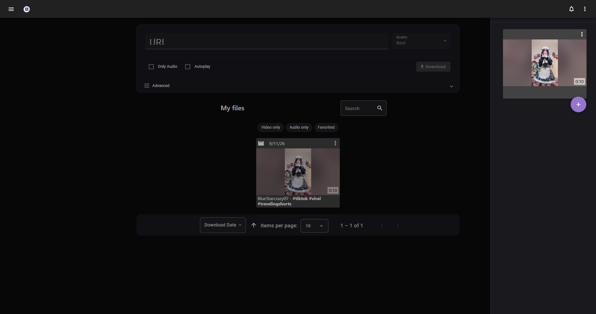
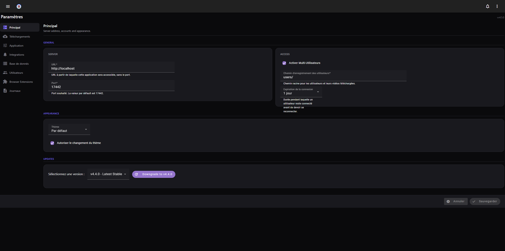
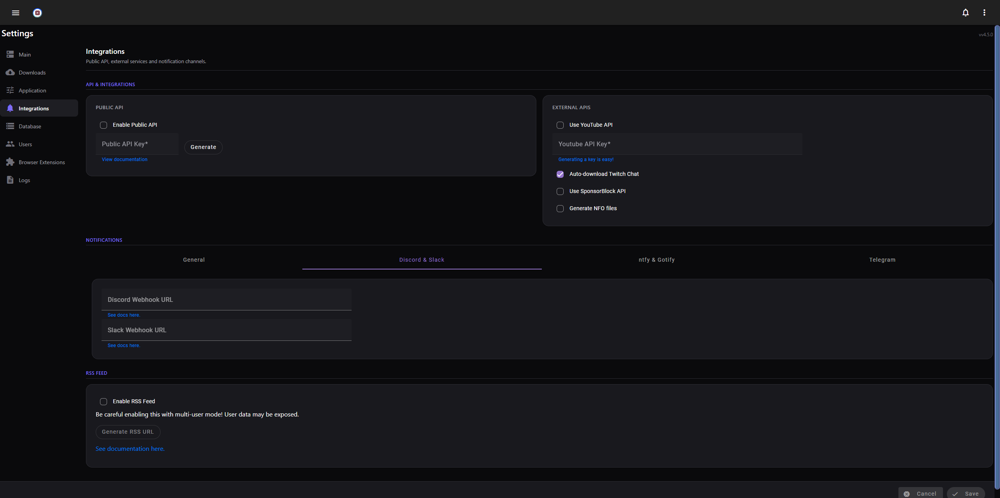

# YoutubeDL-Material

[](https://github.com/Erreur32/YoutubeDL-Material/actions/workflows/mocha.yml)
[](https://github.com/Erreur32/YoutubeDL-Material/actions/workflows/docker.yml)
[](https://heroku.com/deploy?template=https://github.com/Erreur32/YoutubeDL-Material)
[](https://github.com/Erreur32/YoutubeDL-Material/issues)
[](https://github.com/Erreur32/YoutubeDL-Material/blob/master/LICENSE.md)

YoutubeDL-Material is a self-hosted Material Design web app for downloading video/audio, built on [yt-dlp](https://github.com/yt-dlp/yt-dlp). Frontend: [Angular 15](https://angular.io/). Backend: [Node.js](https://nodejs.org/). Runs standalone or via [Docker](#-docker-recommended).

<hr>

## About This Fork

This repository is an **actively maintained fork** of the original [Tzahi12345/YoutubeDL-Material](https://github.com/Tzahi12345/YoutubeDL-Material), which is no longer maintained. It was revived to keep the app working with current `yt-dlp` releases, close security gaps, and modernize the UI.

| | Original project | This fork |
|---|---|---|
| Maintenance | Archived, no longer updated | Actively maintained |
| Download engine | `youtube-dl` | `yt-dlp` (kept up to date) |
| Admin API token | Hardcoded default | Randomly generated at install |
| CORS | Basic/reflective | Hardened allowlist, verified against CodeQL |
| Security | — | Rate limiting, CSRF protection, zip-slip fix, log redaction |
| Settings page | One long list | Reorganized into 8 focused tabs |
| Theme | Light/dark toggle | Dark by default, non-white light theme, live 3-way switch (dark/light/system) |
| CI | Tests only | Tests + ESLint security gate + CodeQL, Docker images published to GHCR |

Issues and pull requests are welcome on this fork's [issue tracker](https://github.com/Erreur32/YoutubeDL-Material/issues).

<details>
<summary><strong>Screenshots</strong></summary>

General view:



Settings - General:



Settings - Integrations:



</details>

<hr>

## Getting Started

The fastest way to run YoutubeDL-Material is [Docker](#-docker-recommended). Prefer running it directly on your machine instead? See [Manual installation](#-manual-installation) or [Build it yourself](#-build-it-yourself--development).

<details>
<summary><strong>🐳 Docker (recommended)</strong></summary>

The image is published to the [GitHub Container Registry](https://github.com/Erreur32/YoutubeDL-Material/pkgs/container/youtubedl-material) (`ghcr.io/erreur32/youtubedl-material`).

1. `curl -L https://github.com/Erreur32/YoutubeDL-Material/releases/latest/download/docker-compose.yml -o docker-compose.yml` (or grab a specific version from the [releases](https://github.com/Erreur32/YoutubeDL-Material/releases/) page).
2. `docker-compose pull`
3. `docker-compose up` — on success you'll see something like `HTTP(S): Started on port 17443` (the *container-internal* port). Check `docker-compose.yml` for the *external* port, which defaults to **8998**.
4. Open the server's URL on that external port in your browser.

**Custom UID/GID**: the container runs as non-root (UID=1000, GID=1000) by default. Override it in `docker-compose.yml`:

```yml
environment:
    UID: YOUR_UID
    GID: YOUR_GID
```

If you're on a Synology NAS, unRAID, Raspberry Pi 4 or another special case, check the issue tracker and the [Wiki](https://github.com/Tzahi12345/YoutubeDL-Material/wiki#environment-specific-guideshelp) for known quirks.

</details>

<details>
<summary><strong>📦 Manual installation</strong></summary>

**Required**: Node.js 16, Python.
**Optional**: AtomicParsley (thumbnail embedding, package `atomicparsley`), [Twitch Downloader CLI](https://github.com/lay295/TwitchDownloader) (Twitch VOD chat downloads).

Debian/Ubuntu:

```bash
curl -fsSL https://deb.nodesource.com/setup_16.x | sudo -E bash -
sudo apt-get install nodejs youtube-dl ffmpeg unzip python npm
```

Steps:

1. Download the [latest release](https://github.com/Erreur32/YoutubeDL-Material/releases/latest) and extract the `youtubedl-material` directory somewhere convenient.
2. Edit `appdata/default.json` to taste.
3. Port forward the port set in `default.json` (default `17442`) — skip this if you're using a [reverse proxy](https://github.com/Tzahi12345/YoutubeDL-Material/wiki/Reverse-Proxy-Setup).
4. Run `npm install`, then `npm start`. Open the server's URL in your browser and try downloading a video to confirm it works.

If something goes wrong, it's usually a configuration issue — check the browser console (right click → Inspect → Console) for errors.

</details>

<details>
<summary><strong>🛠️ Build it yourself / development</strong></summary>

1. Clone the repository, `cd youtubedl-material`, run `npm install`.
2. `cd backend`, run `npm install` again for backend dependencies.
3. Edit the configuration in `youtubedl-material/appdata`.
4. From `youtubedl-material`, run `npm run build` — output goes to `backend/public`.
5. `npm -g install pm2` (optional, for process management).
6. `cd backend`, run `npm start`.

To expose your instance outside your network, either set up a [reverse proxy](https://github.com/Tzahi12345/YoutubeDL-Material/wiki/Reverse-Proxy-Setup), or port forward the configured port (default `17442`) to the server and allow it through the firewall.

</details>

<details>
<summary><strong>🗄️ MongoDB (optional, for large libraries)</strong></summary>

For much better scaling with large datasets (tens of thousands of videos/audios), run YoutubeDL-Material with a MongoDB backend instead of the default JSON file storage. See the [setup tutorial](https://github.com/Tzahi12345/YoutubeDL-Material/wiki/Setting-a-MongoDB-backend-to-use-as-database-provider-for-YTDL-M).

</details>

<details>
<summary><strong>🔌 API</strong></summary>

[API docs](https://youtubedl-material.stoplight.io/docs/youtubedl-material/Public%20API%20v1.yaml)

Enable the public API from Settings → *Integrations*, and generate an API key if one is missing. Then add `apiKey=API_KEY` as a query param to your requests — nearly the whole backend is available through the API.

</details>

<details>
<summary><strong>📱 iOS Shortcut</strong></summary>

Download videos with two taps using this [iOS Shortcut](https://routinehub.co/shortcut/10283/).

</details>

## Contributing

Contributions are welcome! See the [Contributing](https://github.com/Tzahi12345/YoutubeDL-Material/wiki/Contributing) wiki page to get started, or open an [issue](https://github.com/Erreur32/YoutubeDL-Material/issues) for bugs/feature requests. Interested in translations? See the [Translate](https://github.com/Tzahi12345/YoutubeDL-Material/wiki/Translate) wiki page.

## Authors

* **Isaac Grynsztein** ([Tzahi12345](https://github.com/Tzahi12345)) — *Original creator*
* **Erreur32** — *Current maintainer*

Official translators: Spanish (tzahi12345), German (UnlimitedCookies), Chinese (TyRoyal). See also the full list of [contributors](https://github.com/Tzahi12345/YoutubeDL-Material/graphs/contributors).

## License

MIT — see [LICENSE.md](LICENSE.md).

## Legal Disclaimer

This project is in no way affiliated with Google LLC, Alphabet Inc. or YouTube (or their subsidiaries) nor endorsed by them.

## Acknowledgments

* [yt-dlp](https://github.com/yt-dlp/yt-dlp)
* [AllTube](https://github.com/Rudloff/alltube) (for the inspiration)
